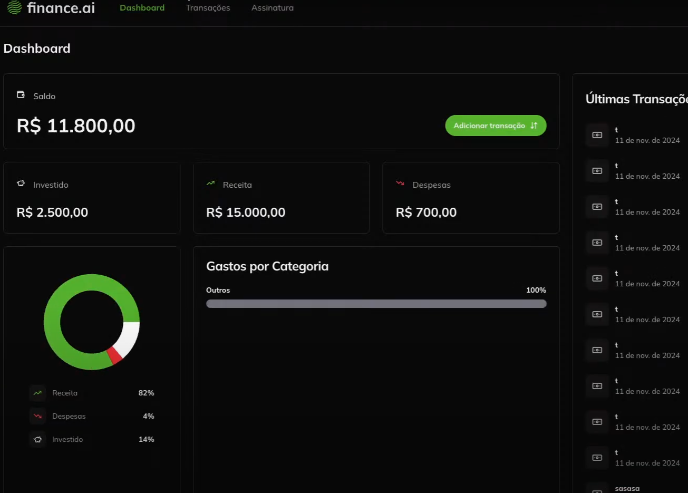

#### Telas

> * Dashboard


#### Resumo

> * NextJS TypeScript
> * ORM Prisma
> * ShadCN UI
> * NeonDB Online
> * TailwindCSS
> * Clerk - Auth

#### Criando projeto

* nextjs new
```
npx create-next-app@14.2.16
```

#### Prisma

* prisma install
```
npm install prisma@5.21
```
* prisma init
```
npx prisma init
```
* prisma format
```
npx prisma format
```

* Prisma migrate
```
npx prisma migrate dev --name init-db
```

* serviço para usar no frontend
```
npm i @prisma/client@5.21
```

#### ShadCN
``` Instalação
npx shadcn@2.1.3 init
```

``` Compoents Button
npx shadcn@latest add button
```

#### Clerk
``` Docs
https://dashboard.clerk.com/apps/app_2v8S9SX4IbzJbUcl80WGuGuzNVf/instances/ins_2v8S9frTs23ZcDe5FBOyqGBLzhf
```

``` 1 Dependência
npm install @clerk/nextjs@5.7.5
```

``` 2 env.
npm install @clerk/nextjs
```

``` 3 CRIAR NO RAIZ middleware.ts
import { clerkMiddleware } from "@clerk/nextjs/server";

export default clerkMiddleware();

export const config = {
  matcher: [
    // Skip Next.js internals and all static files, unless found in search params
    '/((?!_next|[^?]*\\.(?:html?|css|js(?!on)|jpe?g|webp|png|gif|svg|ttf|woff2?|ico|csv|docx?|xlsx?|zip|webmanifest)).*)',
    // Always run for API routes
    '/(api|trpc)(.*)',
  ],
};
```

``` 4 Importar no layout.tsx
  <body
        className={`${geistSans.variable} ${geistMono.variable} antialiased dark`}
      >
        <ClerkProvider>
          {children}
        </ClerkProvider>
      </body>
```

``` 5.1 Import UseNavigation do next
    const { userId } = auth();
    if(userId){
        redirect("/")
    }
```

``` 5.2 Import UseNavigation do next
    <SignInButton>
        <Button variant="outline">
            <LogInIcon className="mr-2" />
            Fazer login ou criar conta
        </Button>
    </SignInButton>
```

``` 5.3 painel
<SignInButton>
                <Button variant="outline">
                    <LogInIcon className="mr-2" />
                    Fazer login ou criar conta
                </Button>
            </SignInButton>
```
https://dashboard.clerk.com/apps/app_2v8S9SX4IbzJbUcl80WGuGuzNVf/instances/ins_2v8S9frTs23ZcDe5FBOyqGBLzhf
```

#### Ref.

* ultimo visto
```
https://alunos.fullstackclub.com.br/area/produto/item/4438357
```

```git
https://github.com/felipemotarocha/fullstackweek-financeai
```

```figma
https://www.figma.com/design/ndIZ9nevfZZCMxCL4lZxfQ/FSW-Finance--LIVE-?node-id=225-2278&t=ChhRdYpvfSiz6LyY-0
```